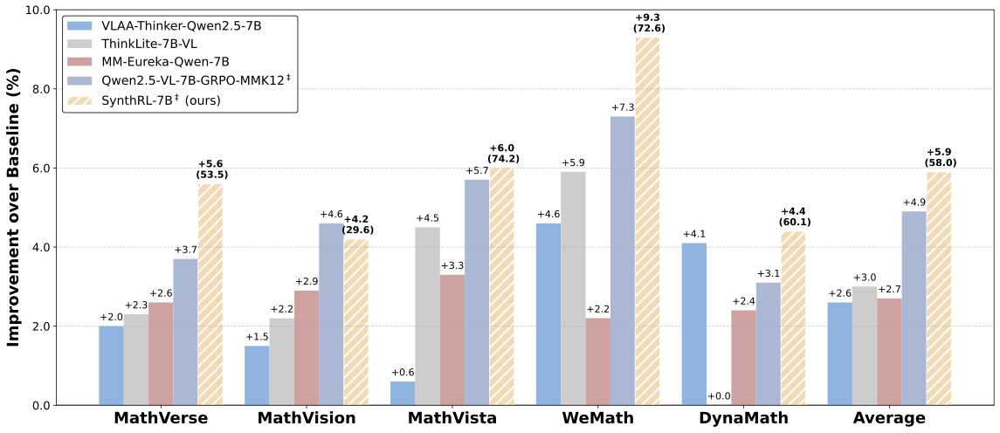
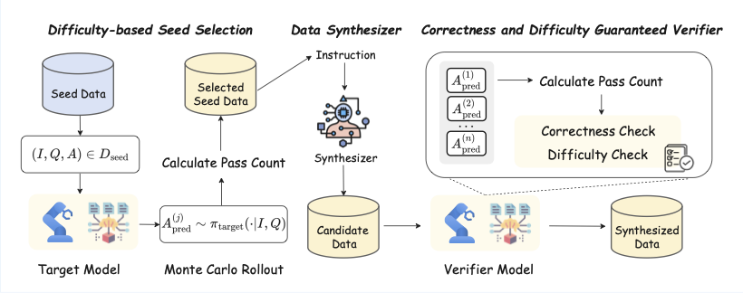

<div align="center">

# SynthRL: Scaling Visual Reasoning with Verifiable Data Synthesis
[](https://arxiv.org/abs/2506.02096) [](https://huggingface.co/collections/Jakumetsu/synthrl-6839d265136fa9ca717105c5)

</div>

## ⚡ Updates
* 22/07/2025: 🏆 Our paper receives Best Paper Honorable Mention at ICML 2025 DataWorld Workshop!

* 01/06/2025: 🎉 We release our paper, models and codebase.

## 🚀 TL;DR
<p align="center">
  
</p>

**SynthRL** is a scalable and guaranteed pipeline for automatic data scaling in reasoning-oriented RL training. It addresses a critical challenge in RLVR (Reinforcement Learning with Verifiable Reward): how to scale the training data with correctness and distribution guarantees to achieve better performance. SynthRL achieves this through a three-stage process:

1. **Seed Data Selection**: Identifying appropriate seed questions based on Monte Carlo rollout pass rates
2. **Targeted Synthesis**: Generating more challenging variants while preserving original answers
3. **Guaranteed Verification**: Ensuring near-perfect correctness and difficulty enhancement

🎯 **Key Benefits**:
- **Scalable data generation** -- automatically synthesizes more challenging, verified questions
- **Strong performance** -- consistent gains across five out-of-domain visual math reasoning benchmarks
- **Enhanced reasoning depth** -- greatest improvements on the most challenging evaluation samples

🔧 Scale your RLVR training data with guaranteed quality and enhanced difficulty!

<p align="center">
  
</p>

## 🛠️ Usage
### (Step 1) Install
```bash
conda create -n synthrl python=3.10 -y && conda activate synthrl
pip install torch==2.5.1 torchvision==0.20.1 torchaudio==2.5.1 transformers==4.49.0 numpy==1.26.4
pip install google-generativeai

pip install -e .
```

### (Step 2) Data Synthesis

First, please download the processed K12-Freeform-8K dataset from [here](https://huggingface.co/datasets/Jakumetsu/K12-Freeform-8K) and put it under `./sampled_data`.

```bash
bash ./scripts/run_evolve_verifiable.sh
```

Please export your Google API key for the synthesizer model. For Qwen model evaluation, please use vLLM or any OpenAI-compatible API that supports Qwen models.

After synthesis is complete, convert the format for RL training:
```bash
python convert_format_for_r1.py --input_path [YOUR_SYNTHESIZED_DATA_NAME]
```

### (Step 3) Training
```bash
bash scripts/run_qwen2_5_vl_7b_synthrl.sh [INFO] [TAG] [SAVE_FREQ] [TOTAL_EPISODES]
```

For example:
```bash
bash scripts/run_qwen2_5_vl_7b_synthrl.sh QWEN2.5-SynthRL A-MMK12-8K 16 8
```

### (Step 4) Evaluation
```bash
bash ./scripts/run_eval_vlm_all.sh [INFO] [TAG]
```

For example:
```bash
bash ./scripts/run_eval_vlm_all.sh QWEN2.5-SynthRL/qwen2_5_vl_7b_A-MMK12-8K
```

This command will run all available checkpoints under this directory using tensor parallelism = 2 and data parallelism = 4.

For evaluation data, please download from [here](https://huggingface.co/datasets/Jakumetsu/SynthRL_evaluation_data), unzip data.zip and place it under the `./evaluation` directory. We provide all the raw difficulty battle records and difficulty Elo ratings for the community for further research.

## Citation
If you find our work useful for your research, please consider citing:
```bibtex
@article{wu2025synthrl,
  title={SynthRL: Scaling Visual Reasoning with Verifiable Data Synthesis},
  author={Wu, Zijian and Ni, Jinjie and Liu, Xiangyan and Liu, Zichen and Yan, Hang and Shieh, Michael Qizhe},
  journal={arXiv preprint arXiv:2506.02096},
  year={2025}
}
```

## Acknowledgement
* The training codes are built on [EasyR1](https://github.com/hiyouga/EasyR1), and the evaluation suite employs [vLLM](https://github.com/vllm-project/vllm) for acceleration.
* The base models are from [Qwen2.5-VL-7B-Instruct](https://huggingface.co/Qwen/Qwen2.5-VL-7B-Instruct).
* The original training dataset is from [MMK12](https://huggingface.co/datasets/FanqingM/MMK12).
* The evaluation datasets are from [MathVerse](https://huggingface.co/datasets/AI4Math/MathVerse), [MathVision](https://huggingface.co/datasets/MathLLMs/MathVision), [MathVista](https://huggingface.co/datasets/AI4Math/MathVista), [WeMath](https://huggingface.co/datasets/We-Math/We-Math), and [DynaMath](https://github.com/DynaMath/DynaMath).